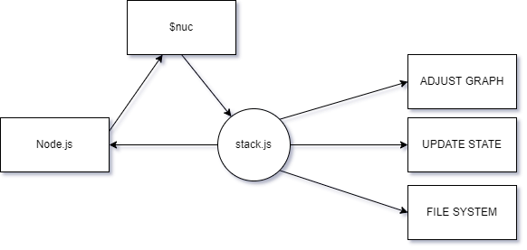

# Mechanics

There are 4 major components:

- `$nuc`
- graph
- state
- runtime-manage `fs`

Nucleoid runtime is embedded in Node.js and once initialized, it accepts JavaScript codes in a function:

## `$nuc`

`$nuc` is an internal Just-in-time compiler. Although unlike traditional compiler, `$nuc` compiles the JS statements based on their condition in the context. For example, `a = 1` translated to `$VAR(a, 1)` as a placeholder, and turns into `$LET(a, 1)` or `$CONST(a, 1)` based on how is it defined in the context.

## graph

Each `$nuc` statement holds information regarding statement relations with other existing statements in the graph. For example `new User()` instance has a class adjacency to `class User {}`, which has adjacency to its instances.

## state

It is like a JS state, but it is managed by the runtime

## Runtime-managed `fs`

Important objectives of Nucleoid runtime manages the control flow with graph and store them in runtime managed `fs` so that the runtime doesn't require external database.

## Example

```javascript
const nucleoid = require("nucleoidai");

nucleoid.run(() => {
  var a = 1;
});

// or

app.post("/test", () => {
  var a = 1;
});

app.listen(3000);
```

Here is the logical diagram of the runtime, and let's dive into to details



1. When Node.js passes over the function, very first step is the function string is parsed into [`$nuc`](https://github.com/NucleoidAI/Nucleoid/tree/main/src/lang/%24nuc) structure as [CIL](https://en.wikipedia.org/wiki/Common_Intermediate_Language) language, which holds input statements as executable.

> Something keep in mind, every programming language actually works with string and compiles to executable binaries or bytes, one thing is slightly different in the Nucleoid project, all CIL conversion happens at runtime instead of compile time. This gives advantages when manipulating [Control Flow](https://en.wikipedia.org/wiki/Control_flow) and data.

For example, this is a function definition in the runtime, once entry function is parsed, it is held like this in order to run in `stack.js`.

```javascript
class $FUNCTION extends $ {
  run() {
    const statement = new FUNCTION();
    statement.name = this.name;
    statement.args = this.args;
    statement.block = this.block;
    return statement;
  }
}
```

2. After an entry function is converted into `$nuc`, it runs each statement in [`stack.js`](https://github.com/NucleoidAI/Nucleoid/blob/main/src/stack.js), which is the core part of the runtime because the control flow is managed by stack and the stack decides sequence of statement based on the graph. For example:

```javascript
class Item {
  constructor(name) {
    this.name = name;
  }
}
nucleoid.register(Item);
nucleoid.run(() => new Item("ITEM-1"));
```

This :point_up_2: is executed like this:

```javascript
state.Item = class Item {};
state.item0 = new Item();
state.item0.id = "item0";
state.item0.name = "ITEM-1";
```

and these decisions are `stack.js`'s responsibility.

3. The last part is the runtime stores each statement as well as their state in the file system, which is also managed by the runtime so that it doesn't require external database.

> It is not the main focus of project but eliminating external databases gives better performance since there is no TCP/IP communication required.

4. If an exception occur during the process, the runtime automatically rolls back the state.
